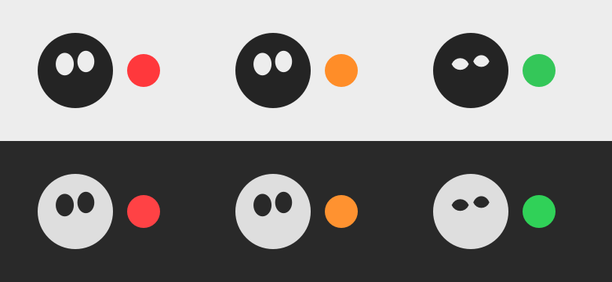

<p align="center">
  
</p>

<h1 align="center">Orexin</h1>

<p align="center">A macOS menu bar app that shows what's keeping your Mac awake.</p>

---

Ever come back to a Mac that should have gone to sleep hours ago? Orexin sits in your menu bar and tells you which app (or system process) is preventing sleep, for how long, and why. It also keeps a history, so you can find out afterwards what kept your Mac up all night.

It's named after [orexin](https://en.wikipedia.org/wiki/Orexin), the neuropeptide that keeps us awake.

<p align="center">
  
</p>

## Installation

1. **Download** `Orexin-1.0.dmg` from the [latest release](https://github.com/erg1000/Orexin/releases/latest).
2. **Open the DMG** and drag **Orexin** onto the **Applications** folder.
3. **Open Orexin** from your Applications folder. macOS will say *"Orexin" Not Opened* because the app isn't notarized by Apple (see [why](#why-does-macos-warn-about-orexin)). Click **Done**.
4. **Allow it once:** open **System Settings → Privacy & Security**, scroll down to the *Security* section, and click **Open Anyway** next to *"Orexin" was blocked…*. Confirm with your password or Touch ID, then click **Open Anyway** again.
5. **Look at the top right of your screen.** Orexin lives in the menu bar as a small moon 🌝. It has no window and no Dock icon, so nothing else appears when it starts.
6. Optional: click the moon and turn on **Launch at Login** so it starts automatically.

> **Can't see the moon?** On MacBooks with a notch, menu bar icons can hide behind it when the menu bar is full. Quit a few other menu bar apps, or hold ⌘ and drag other icons to make room.

<details>
<summary>Prefer the Terminal?</summary>

Instead of steps 3–4, remove the download quarantine and open the app:

```bash
xattr -dr com.apple.quarantine /Applications/Orexin.app
open /Applications/Orexin.app
```
</details>

### Why does macOS warn about Orexin?

Apple only lets apps open without a warning if they're signed with a paid Apple Developer ID and notarized. Orexin is a free, open-source project and isn't notarized (yet), so macOS asks you to confirm once. The full source is in this repository, and you can [build it yourself](#building-from-source) instead.

### Uninstalling

Quit Orexin (click the moon → **Quit Orexin**), turn off **Launch at Login** first if you enabled it, and move `Orexin.app` from Applications to the Trash. To also remove its settings and history, delete `~/Library/Containers/actionkraft.Orexin`.

## Features

- **Status at a glance.** The moon's eyes are open while something keeps your Mac awake and closed when it's free to sleep. The dot shows who's responsible:
  - 🔴 an app is preventing sleep
  - 🟠 only system processes are (when "Show System Processes" is on)
  - 🟢 nothing is
- **What, why and how long.** Each blocker shows its name, whether it keeps the system or the display awake, how long it has been doing so, and its reasons, e.g. *Google Chrome – Playing audio · 1 hr, 12 min*.
- **Finds the real app.** Helper processes (like browser renderers) and audio played through `coreaudiod` are attributed to the app behind them.
- **Sleep history.** A window (⌘Y) listing, day by day, when the Mac slept and woke and everything that kept it awake for more than a minute. Kept for 14 days.
- **Notifications.** Get notified when something has kept your Mac awake for 15 minutes, 30 minutes, 1 hour or 2 hours.
- **Ignore list.** Hide apps you don't care about so they don't affect the status.
- **Keep Mac Awake.** Like `caffeinate -i`: keep the Mac awake until you turn it off, or for 15 minutes to 5 hours.
- **Launch at login**, and no Dock icon.

Noise is filtered out: macOS's own "stay awake while the display is on" assertion, Handoff, and the few seconds apps get to finish work when they go into the background.

## Requirements

- macOS 26.5 or later, on Apple silicon or Intel

## Building from source

Requires Xcode 26.5 or later.

1. Clone the repository and open `Orexin.xcodeproj` in Xcode.
2. Select your own team under *Signing & Capabilities* (and change the bundle identifier if needed).
3. Press ⌘R. Orexin appears in the menu bar; there's no window or Dock icon.

To install your build, archive the app (Product → Archive → Distribute App → Custom → Copy App) and move `Orexin.app` to `/Applications`. Launch at Login only works from there.

To create the downloadable DMG for a release, run `scripts/make-release.sh`. It builds a universal app and writes `build/Orexin-<version>.dmg`.

## How it works

Orexin reads macOS power assertions with the public IOKit API `IOPMCopyAssertionsByProcess`, the same information `pmset -g assertions` prints, and refreshes every few seconds. Assertions created on behalf of another process are attributed to that process, and helpers inside an app bundle are mapped to their app. Keep Mac Awake holds its own `PreventUserIdleSystemSleep` assertion.

The app is sandboxed and uses no private API, so it's eligible for the Mac App Store. Because of that, it can't quit other apps, and WebKit's shared services (used by Safari, Mail and others) show up as "Web Content (Safari etc.)" rather than the specific app.

## Privacy

Orexin collects no data and makes no network connections. Its settings and history stay on your Mac.

## Updating the app icon

The icon artwork lives in [`Design/AppIcon.png`](Design/AppIcon.png) (1024 × 1024, full bleed). The sizes in `Orexin/Assets.xcassets/AppIcon.appiconset` are generated from it, masked to the macOS icon shape. The menu bar icon is drawn in code in [`OrexinApp.swift`](Orexin/OrexinApp.swift).

## License

[MIT](LICENSE) © 2026 Ergün Kayis
